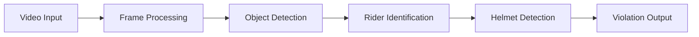
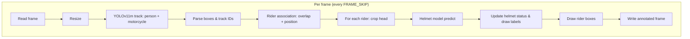

# Helmet Violation Detection 🚦

This project detects motorcycle riders in traffic videos and checks whether they are wearing helmets using computer vision.

The system identifies riders and classifies helmet vs no-helmet cases and can log violations.

---

## Features

- **Person & motorcycle tracking** – YOLOv11m + ByteTrack for stable IDs across frames  
- **Rider association** – Heuristics (overlap, vertical/horizontal position) to distinguish riders from pedestrians  
- **Helmet classification** – Custom YOLO model on rider head crops (helmet / no helmet)  
- **Annotated output video** – Tracking boxes, rider boxes, and helmet/no-helmet labels  
- **Violation logging** – Optional save of frames and crops for riders classified as no-helmet  
---

## Tech Stack

- Python
- OpenCV
- YOLO (Ultralytics)
- ByteTrack (tracking)

---

## Project Pipeline






---

## Project Structure

```
Helmet-Violation-Detection/
├── app.py                 # Entry point: calls run()
├── application.py         # Main loop: read → transform → detect → postprocess → write
├── setup.py
├── requirements.txt
├── src/
│   ├── config.py          # Paths, FRAME_SKIP, OVERLAP_THRESHOLD, etc.
│   ├── exception.py
│   ├── logger.py
│   ├── ingestion/
│   │   └── video_reader.py # VideoReader, OutputVideoWriter
│   ├── preprocessing/
│   │   └── frame_transform.py
│   └── inference/
│       ├── detector.py    # PersonMotorcycleTracker (YOLOv11m)
│       └── postprocess.py # RiderHelmetPostProcessor (rider + helmet logic)
├── assets/
│   └── videos/           # Input video, output video
├── models/
│   └── yolo/
│       └── best.pt        # Trained helmet classifier (you provide)
└── notebooks/             # Original Colab / exploration
```

---

**Two-model design:**

| Component                    | Model | Role |
|------------------------------|--------|------|
| **PersonMotorcycleTracker**  | YOLOv11m (pretrained) | Detect & track **person** (0) and **motorcycle** (3) across frames |
| **RiderHelmetPostProcessor** | Custom `best.pt` (trained on helmet data) | Classify **helmet** vs **no helmet** on rider head crops |


## Installation

Clone the repository

```
git clone https://github.com/YOUR_USERNAME/Helmet-Violation-Detection.git
cd Helmet-Violation-Detection
```

Install dependencies

```
pip install -r requirements.txt
```

---

## Usage

Run the application

```
python app.py
```

The processed output video will be saved in:

```
assets/videos/output_video.mp4
```

---


## Author

Harsh Chandrul